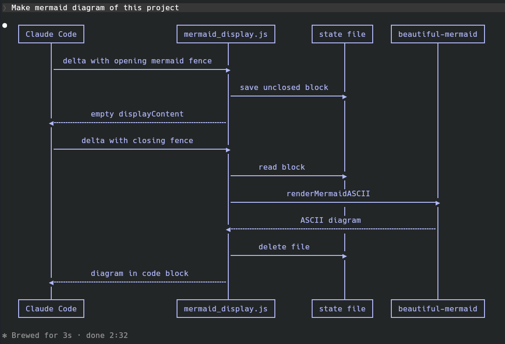

# claude-mermaid

Claude Code renders tables, lists and syntax highlighting in the terminal, but ` ```mermaid ` blocks come out as raw source. So Claude falls back to hand-drawn ASCII diagrams, and they drift out of alignment.

This hook fixes that. Claude writes plain Mermaid, and the terminal shows a real diagram drawn by [beautiful-mermaid](https://github.com/lukilabs/beautiful-mermaid):



## Install

Requires Claude Code 2.1.277 or later, and Bun or Node.js on `PATH`.

Add this repo as a plugin marketplace, then install the plugin from it:

```sh
claude plugin marketplace add txssu/claude-mermaid
claude plugin install claude-mermaid@claude-mermaid
```

Restart Claude Code to apply. The same commands work inside Claude Code as `/plugin marketplace add …` and `/plugin install …`.

To update later:

```sh
claude plugin update claude-mermaid@claude-mermaid
```

## Usage

Ask Claude for a diagram, e.g. "draw a sequence diagram of this project". The plugin tells Claude at session start that Mermaid is rendered, so it writes Mermaid instead of ASCII art. Flowcharts, state, sequence, class, ER and XY charts are supported.

Only the screen changes: the transcript and Claude's context keep the Mermaid source. If a diagram fails to render or is wider than the terminal, the source is shown as is.

A block split across streaming chunks is kept in `$XDG_RUNTIME_DIR/claude-mermaid/` until it closes.

## Development

```sh
bun install
bun run test
```

`dist/` is committed, since plugins are installed without `bun install`. Rebuild it with `bun run build`.

## License

MIT
